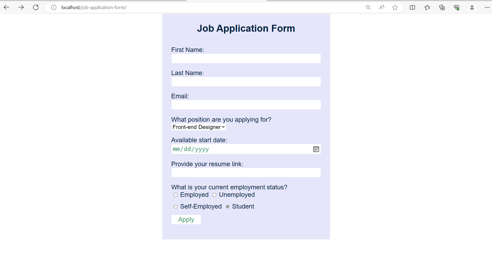

# Job Application Form

This project is about job application form fillup system with basic CRUD (Create, Read, Update, Delete) operations. The goal of this project is to streamline the job application process, making it efficient for both applicants and administrators.




# Features
* Create - Add new job applications to the system fillup by Applicant
* Read - view existing applications with ease
* Update - Modify information within applications as needed.
* Delete - Remove applications that are no longer relevant.
* Responsive, user-friendly application form

# Download & Setup Instructions
* 0 - install xampp of your system for(Apache and mysql DBMS)
* 1 - Clone project: git clone https://github.com/Silentso/job-application-form
* 2 - cd job-application-form
* 3 - Unzip file on your local system copy job-application-form folder.
* 4 - Put job-application-form folder inside (htdocs of xampp) root directory
* 5 - start Apache and MySql server
* 6 - Open Your browser goto given url “http://localhost/job-application-form/”

# Database Configuration

Open phpmyadmin

Create Database called job with the help of below SQL Query.
```
CREATE DATABASE [IF NOT EXISTS] job
```
create table job_application with the help of below SQL Query.
```
create table job_application (
    id int auto_increment primary key,
    firstname varchar(255) not null,
    lastname varchar(255) not null,
    email varchar(255) not null,
    position varchar(255) not null,
    `date` date not null,
    resume_link varchar(2083) not null,
    emp_status varchar(32) not null);
```
* author name-- Ankit Krishna Manandhar
* For More Details --- https://github.com/Silentso/job-application-form
